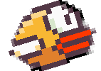
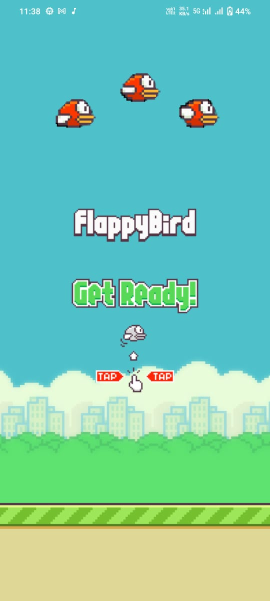
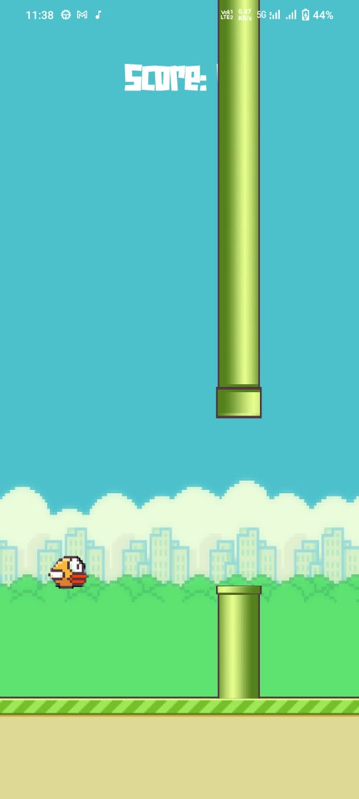
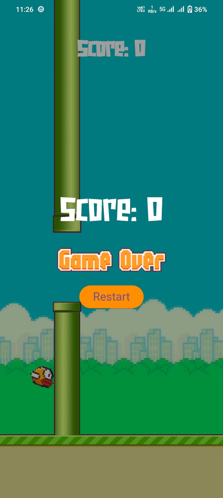

<!--  -->

<h2>🚀 Demo</h2>

https://github.com/luciferro01/Flappy/assets/108746571/844ab419-b830-4685-a0f6-450e72c1f08a

<h2>Project Screenshots:</h2>

<h2>🛠️ Installation Steps:</h2>

1. Download APK File

2. Getting Started

This project is a starting point for a Flutter application.

A few resources to get you started if this is your first Flutter project:

- [Lab: Write your first Flutter app](https://docs.flutter.dev/get-started/codelab)
- [Cookbook: Useful Flutter samples](https://docs.flutter.dev/cookbook)

For help getting started with Flutter development, view the
[online documentation](https://docs.flutter.dev/), which offers tutorials,
samples, guidance on mobile development, and a full API reference.
